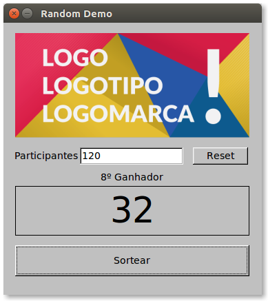

# Trabalho 7: Sorteio de brindes para participantes de evento

## Deadline

Domingo, 4 de junho, 23:59.

## Entrega

 1. Seu trabalho será entregue no seu **repositório** da disciplina no GitHub. Este repositório deve ter sido informado quando você respondeu o questionário indicado pela professora no primeiro dia de aula. 

 2. Na raiz do seu repositório da disciplina, crie uma pasta chamada `t7` (atenção: letra minúscula).

 3. Coloque todos os arquivos do seu trabalho dentro desta pasta.

## Problema

Um evento para estudantes recebeu vários brindes de um patrocinador. Deciciu-se que esses brindes deveriam ser sorteados durante o jantar de confraternização do evento, usando um programa feito pelos estudantes :-) Na entrada do restaurante, cada participante recebe uma comanda com um número sequencial, de 1 até o número de participantes. No sorteio, é sorteado um número por vez, sem repetição. Cada número sorteado deve ser mostrado num telão.

## Requisitos

- Para resolver o problema acima, você deverá criar uma solução orientada a objetos com interface gráfica. Você pode escolher a linguagem e o toolkit que preferir, desde que seu código possa ser executado em diferentes plataformas.

 

- A interface do seu programa deverá prover acesso às seguintes funcionalidades:
  - Entrada do número de participantes;
  - Botão para sortear um número, sem repetição;
  - Botão `Reset`, que limpa a janela e reinicia o sorteio;
  - Exibição de cada número sorteado, com a informação de sequência (1º ganhador, 2º ganhador, etc.);
  - Exibição do logotipo da empresa patrocinadora.
  Ao lado encontra-se um exemplo de interface que oferece tais funcionalidades (logotipo emprestado [desta fonte](http://www.printi.com.br/blog/descubra-diferenca-entre-logo-logotipo-e-logomarca)).
 

- Para implementar o sorteio sem repetição, você deverá gerar uma lista de números que deverá ser embaralhada aleatoriamente (procure por funções que fazem `shuffle`). Essa lista será percorrida elemento por elemento a cada vez que o botão `Sortear` for pressionado.

- Seu programa não deve permitir sortear números enquanto o usuário não informar o número de participantes. Para isso, você pode inicialmente desativar o botão `Sortear` ou emitir um alerta caso o botão seja pressionado antes da entrada do número.

- Se o usuário clicar muitas vezes em `Sortear` e chegar ao final da lista gerada, seu programa deverá emitir um alerta.

