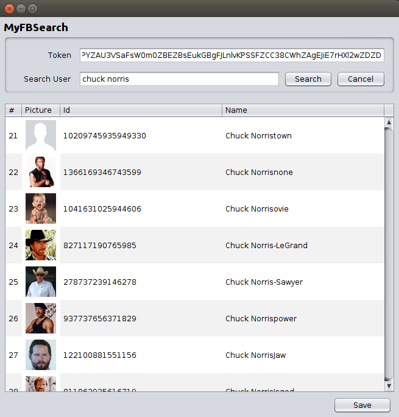

# Trabalho 9: MyFBSearch em Java

## Deadline

- Entrega: Quinta-feira, 7 de julho de 2016, 23:59.
- Apresentação: Dias 8 ou 11 de julho de 2016 (sexta ou segunda), com agendamento

## Problema

Uma agência de comunicação gerencia várias marcas de seus clientes usando redes sociais, principalmente Facebook. São feitos posts diários em páginas dos clientes, são lançados concursos para o público consumidor e o impacto disso é visualizado usando a própria plataforma de insights do Facebook. Todo esse trabalho é feito manualmente, usando as interfaces web ou mobile do Facebook. 

Numa campanha concebida pela agência para vários de seus clientes, foi necessário coletar fotos (profile pictures) de um grande número de pessoas no Facebook, para criação de posts personalizados. Esse trabalho também começou a ser feito manualmente e estava levando muito tempo. A agência então resolveu contratar o serviço de um **profissional de computação**, a fim de automatizar essa tarefa repetitiva e, com isso, atender mais clientes, com mais agilidade. Você é este profissional! Sua solução foi desenvolver o **MyFBSearch**, uma aplicação para desktop em Java, capaz de obter várias fotos com poucos cliques (ver exemplo abaixo). 

 

## Requisitos

- Você deve criar uma solução orientada a objetos (preferencialmente em Java) para resolver o problema acima, com interface gráfica (GUI) para desktop, seguindo o padrão MVC (Model-View-Controller).

- As funcionalidades **mínimas** da aplicação são as seguintes:
  - Permitir que o usuário informe um token (para autenticação no Facebook) e um nome a ser buscado.
  - Obter uma lista de perfis no Facebook que atendam ao critério de busca. 
  - Mostrar a lista em forma de tabela na interface gráfica, com as seguintes colunas, não necessariamente nesta ordem: id (do Facebook), nome, foto e número sequencial (gerado pela aplicação: por exemplo, se a busca retornar 20 perfis para um mesmo nome, o número sequencial vai variar de 1 a 20).
  - Permitir que o usuário cancele uma busca que estiver em andamento.
  - Permitir que o usuário salve os resultados da busca em forma de arquivos com as fotos dos perfis.

- Sua aplicação deverá ser desenvolvida incrementalmente, com **commits e pushes frequentes** ao seu repositório da disciplina no Github. Trabalhos com um ou poucos commits próximos à data de entrega terão nota reduzida ou zerada. 

## Dicas

- Veja estes [slides](slides-t9-2016a.pdf) com comentários sobre o trabalho.

- Para conexão com o Facebook, recomenda-se usar a [RestFB](http://restfb.com), uma API em Java para acesso à Graph API do Facebook. Há [exemplos de uso](https://github.com/restfb/restfb-examples) desta API que servem como ponto de partida para as consultas necessárias para esse trabalho. Na [documentação da RestFB](http://restfb.com/documentation/), estude principalmente as seções sobre busca (Searching) e sobre obtenção de fotos de usuários (Fetching User Picture). É normal ter dúvidas e problemas aqui, e faz parte do trabalho solucioná-los. No entanto, se você não conseguir avançar mesmo depois de fazer várias tentativas (com atenção e lógica, não aleatoriamente), procure ajuda. 

- Depois que você fizer funcionar a comunicação com o Facebook, crie uma interface gráfica intermediária, só com botões e campos/áreas de texto, para fazer realizar a busca e visualizar os resultados de forma simplificada. Depois de fazer isso funcionar, concentre-se em implementar os demais requisitos.

- No desenvolvimento da interface gráfica, o componente que exigirá mais esforço é a tabela (`JTable`). Você deverá customizá-la para mostrar os dados e a imagem de cada usuário, que são gerados dinamicamente a partir da consulta ao Facebook. Basicamente, você precisará criar classes que estendem (extends) outras classes da plataforma Java. As principais classes aqui são a `AbstractTableModel` e a `DefaultTableCellRenderer`. Há várias informações sobre isso neste [tutorial da Oracle](http://docs.oracle.com/javase/tutorial/uiswing/components/table.html). Para mostrar células da tabela com imagens, você pode estender a classe `DefaultTableCellRenderer` para produzir um `JLabel`. Esse label não terá texto, mas sim um ícone (`ImageIcon`) criado a partir da `URL` da imagem do perfil do usuário no Facebook.

- Para organização do código segundo o padrão MVC, lembre-se que o objetivo disso é separar as classes, evitando principalmente misturar código da GUI com código que trata da lógica da aplicação. Isso deve facilitar a leitura e a manutenção do código, pois cada classe cuida de sua parte do problema (problemas complicados podem ser de fácil solução quando decompostos em partes menores). Essa organização também facilita o reuso: por exemplo, é comum reusar uma mesma representação de dados/lógica com diferentes apresentações ao usuário (web, mobile, desktop). No padrão MVC, as classes de visão (View) tratam somente de apresentar os dados ao usuário. As classes de modelo (Model) contêm a lógica da aplicação e a representação dos dados. As classes de controle (Controller) tomam as decisões sobre o que fazer a partir das ações do usuário. Para aprender mais sobre isso, você pode estudar este [código de exemplo](DisciplinaGUI.zip).

- Para poder cancelar uma busca, você deverá lançá-la em uma thread independente, cuja execução é iniciada com o botão `Search`. O botão `Cancel` deverá interromper essa thread. Há um exemplo disso no último roteiro de prática de Java.

## Entrega

 1. No seu repositório da disciplina no GitHub, crie uma pasta chamada `t9`.
 2. Coloque todos os arquivos dentro da pasta `t9` (se usar um IDE como NetBeans, coloque todos os arquivos do projeto dentro da pasta `t9`).
 3. Lembre-se de fazer commits e pushes frequentes no repositório.
 4. Preencha os dados do seu trabalho [neste formulário](https://docs.google.com/forms/d/1DsRz-RBcHW-1FfFHSGZ9Ac2clkcuT0_Ips99rriXFkE/viewform?fbzx=1355909539722969958).
 5. Agende a apresentação do trabalho com a professora. 
